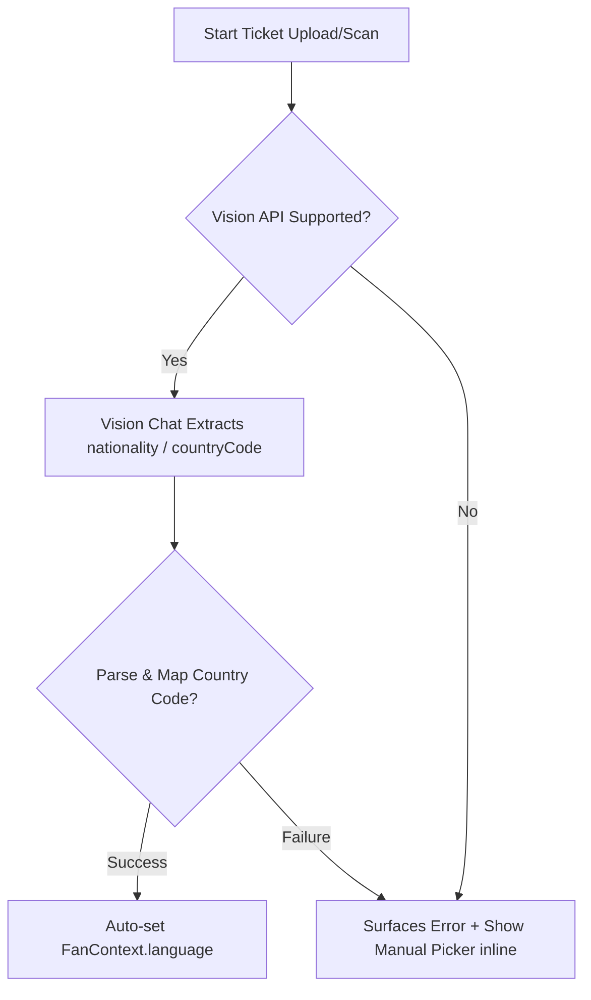

# M12 — Multilingual Concierge

The Multilingual Concierge maps the fan's nationality to their preferred language automatically via ticket-scanning. A manual settings picker is provided as a persistent fallback and override.

---

## 48-Nation World Cup 2026 Lookup Table

The mapping lookup supports both ISO 2-letter and 3-letter country codes for all 48 participating World Cup 2026 nations.

### Multi-Lingual Country Defaults
Countries with multiple official languages default to their most common choice and return a `confidence: 'low'` flag:
- **Canada (`CAN`/`CA`)**: Defaults to `'en'` (English), `confidence: 'low'`.
- **Belgium (`BEL`/`BE`)**: Defaults to `'nl'` (Dutch), `confidence: 'low'`.
- **Switzerland (`SUI`/`CH`)**: Defaults to `'de'` (German), `confidence: 'low'`.
- **South Africa (`ZAF`/`ZA`)**: Defaults to `'en'` (English), `confidence: 'low'`.
- **Cameroon (`CMR`/`CM`)**: Defaults to `'fr'` (French), `confidence: 'low'`.
- **Morocco (`MAR`/`MA`)**: Defaults to `'ar'` (Arabic), `confidence: 'low'`.
- **Wales (`WAL`)**: Defaults to `'en'` (English), `confidence: 'low'`.
- **Uzbekistan (`UZB`/`UZ`)**: Defaults to `'uz'` (Uzbek), `confidence: 'low'`.

All other standard single-language countries return `confidence: 'high'`. Any unknown/unsupported country code defaults gracefully to English (`'en'`) with `confidence: 'low'`.

---

## Language Fallback Chain

1. **Auto-Detection (Ticket Scan)**: The fan uploads a ticket image. The F4 vision client extracts the `countryCode` and updates `FanContext.language` automatically.
2. **Error Inline Fallback**: If the scan fails, vision is unsupported, or network requests error out, an inline error banner is rendered in the card alongside the manual picker so the fan is never locked out.
3. **Persistent Override**: A `<LanguagePicker>` dropdown is rendered inside the main header next to sensory settings. The fan can override the language at any time.

---

## Adversarial Injection Defense

To secure the vision API, the response returned by the vision model is parsed through a strict schema validation check. Unrecognized fields, prompts, or adversarial script injections inside the image content are rejected, extracting only the expected ticket fields (`section`, `gate`, `nationality`, `countryCode`, `seat`).

---

## Boundaries & Out of Scope

- **Chat Response Translation**: Full chat response translations are performed by the M2 Copilot once connected. This module is responsible only for the BCP-47 language setting.
- **Global App Localizations**: Translating the entire application's text into BCP-47 languages is out of scope. Localizations are constrained to the onboarding card alerts and header pickers.
